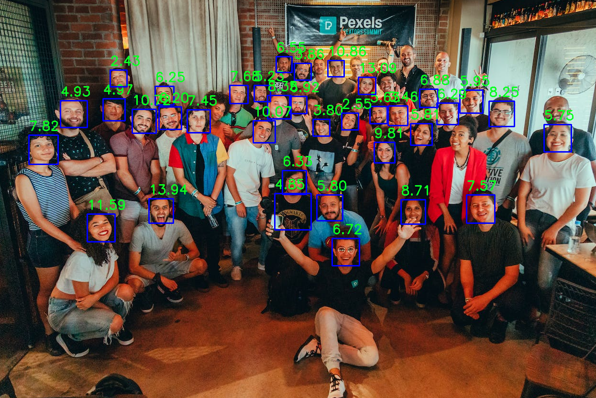

# Evaluation of Viola-Jones face detector

## Project Structure

The folder structure of the project is built around the [fddb_evaluation_docker](https://github.com/jan3zk/fddb_evaluation_docker) repository, which requires a specific folder structure to enable correct evaluation. The structure is as follows:

- **Folders**
    - `cascades` - *XML files of OpenCV cascades*
    - `CUSTOM-folds` - *CUSTOM fold annotations for our own dataset pulled from Flickr and other various sites that have the CC0 license or similar*
    - `customPics` - *CUSTOM dataset images pulled from Flickr or other various sites that have the CC0 license or similar*
    - `docs` - *Documentation folder with assets and a full technical report on the exercise*
    - `evaluation` - *Scripts from [fddb_evaluation_docker](https://github.com/jan3zk/fddb_evaluation_docker) that are needed for the evaluation of the FDDB dataset*
    - `FDDB-folds` - *FDDB dataset annotations pulled from [Face Detection Data Set and Benchmark - FDDB](http://vis-www.cs.umass.edu/fddb/)*
    - `originalPics` - *FDDB dataset images pulled from [Face Detection Data Set and Benchmark - FDDB](http://vis-www.cs.umass.edu/fddb/)*
    - `results-custom` - *Fold-out txt files obtained after running the `viola-jones-custom.py` script*
    - `results-default` - *Fold-out txt files obtained after running the `viola-jones-fold.py` script*
    - `runScripts` - *The non-optimized global detector parameters iteration script for the `viola-jones-fold.py` script*
    - `testScripts` - *The test scripts for `viola-jones-fold.py`/`viola-jones-custom.py` that run the detection and execute the evaluation*

- **Files**
    - `detectionsContROC.*` - *Evaluation files (Continuous png/txt) for the last ran detection script on FDDB dataset*
    - `detectionsDiscROC.*` - *Evaluation files (Discontionuous png/txt) for the last ran detection script on FDDB dataset*
    - `Dockerfile` - *Dockerfile of the [fddb_evaluation_docker](https://github.com/jan3zk/fddb_evaluation_docker)*
    - `evaluate-custom.py` - *Evaluation script for the custom dataset since we don't have face positional annotations for it*
    - `viola-jones-all.py` - *Runs the detection on the 10 FDDB folds (Script is not command flag parameterized)*
    - `viola-jones-custom.py` - *Runs the detection on the CUSTOM folds (Script is command flag parameterized)*
    - `viola-jones-fold.py` - *Runs the detection on one of the 10 FDDB folds (Script is command flag parameterized)*


## Running the code

The code can be run differently for the FDDB dataset or the CUSTOM dataset:

- **FDDB dataset**

    ```bash
    # Default run of all 10 folds
    python3 viola-jones-all.py
    # Default evaluation of all 10 folds
    docker run --rm -it -v $(pwd):/FDDB housebw/fddb-evaluator
    ```
    ```bash
    # Input
    python3 viola-jones-fold.py --help

    # Output
    usage: viola-jones-fold.py [-h] [--cascade CASCADE] [--scaleFactor SCALEFACTOR] [--minNeighbors MINNEIGHBORS] [--minSizeX MINSIZEX] [--minSizeY MINSIZEY] [--maxSizeX MAXSIZEX] [--maxSizeY MAXSIZEY] [--display DISPLAY] [--displayTime DISPLAYTIME] [--foldNum FOLDNUM]

    Viola-Jones face detector

    options:
    -h, --help                  show this help message and exit
    --cascade CASCADE           HAAR cascade file, you can change the cascade file to try different detectors. Possible options for face detections include the following: haarcascade_frontalface_alt.xml, haarcascade_frontalface_alt2.xml,  haarcascade_frontalface_alt_tree.xml,  haarcascade_frontalface_default.xml
    --scaleFactor SCALEFACTOR   scale factor used for the detector
    --minNeighbors MINNEIGHBORS min neighbors used for the detector
    --minSizeX MINSIZEX         min size of the sliding window in x direction
    --minSizeY MINSIZEY         min size of the sliding window in y direction
    --maxSizeX MAXSIZEX         max size of the sliding window in x direction
    --maxSizeY MAXSIZEY         max size of the sliding window in y direction
    --display DISPLAY           displays all images with detections that are above the threshold
    --displayTime DISPLAYTIME   time in s to display each image, only used if display is set to True
    --foldNum FOLDNUM           fold number to process
    ```

    ```bash
    # Default run of 1 FDDB fold with image display and then evaluate all 10 folds
    cd testScripts/ && ./testDefault.sh
    ```

    ```bash
    # Automatic run of multiple 10 folds with changing detector parameters (Edit the bash script for different parameters)
    cd runScripts/ && ./runDefault.sh
    ```

- **CUSTOM dataset**

    ```bash
    # Default run of the CUSTOM fold
    python3 viola-jones-custom.py
    # Default evaluation of the CUSTOM fold
    python3 evaluate-custom.py
    ```

    ```bash
    # Input
    python3 viola-jones-custom.py --help

    # Output
    usage: viola-jones-custom.py [-h] [--cascade CASCADE] [--scaleFactor SCALEFACTOR] [--minNeighbors MINNEIGHBORS] [--minSizeX MINSIZEX] [--minSizeY MINSIZEY] [--maxSizeX MAXSIZEX] [--maxSizeY MAXSIZEY] [--display DISPLAY] [--displayTime DISPLAYTIME] [--foldNum FOLDNUM]

    Viola-Jones face detector

    options:
    -h, --help                  show this help message and exit
    --cascade CASCADE           HAAR cascade file, you can change the cascade file to try different detectors. Possible options for face detections include the following: haarcascade_frontalface_alt.xml, haarcascade_frontalface_alt2.xml,  haarcascade_frontalface_alt_tree.xml,  haarcascade_frontalface_default.xml
    --scaleFactor SCALEFACTOR   scale factor used for the detector
    --minNeighbors MINNEIGHBORS min neighbors used for the detector
    --minSizeX MINSIZEX         min size of the sliding window in x direction
    --minSizeY MINSIZEY         min size of the sliding window in y direction
    --maxSizeX MAXSIZEX         max size of the sliding window in x direction
    --maxSizeY MAXSIZEY         max size of the sliding window in y direction
    --display DISPLAY           displays all images with detections that are above the threshold
    --displayTime DISPLAYTIME   time in s to display each image, only used if display is set to True
    ```

    ```bash
    # Default run of the CUSTOM fold with the evaluation
    cd testScripts/ && ./testCustom.sh
    ```

Before running any of the above bash scripts make sure to:
```bash
chmod +x <Name of the script>
```


## QA


**Question 1:**

Explain your approach for generating detection scores. If you chose an already published method, summarize it briefly and provide the appropriate source, along with your rationale for selecting that approach. If you modified any of the published methods, explain why the modification was necessary or why you chose to make it. If you have chosen to propose your own approach, present it and explain how it works.

**Answer 1:**

We used the already available calculation of detection scores provided by OpenCV and the FDDB evaluation, which to summarize does the following:

- ***OpenCV Confidence Value (Calculates weights of the specified cascade):***
    - Initial values of the weights are equally distributed and set to 1.
    - Going through the cascade, the weights are calculated based on the value of the cascade.
    - From the summed weights, we calculate the confidence used for thresholding in the FDDB evaluation.

- ***FDDB Evaluation Score (Copied directly from [FAQ](http://vis-www.cs.umass.edu/fddb/faq.html)):***
    > In the OpenCV implementation, stage_sum is computed and compared against the i stage_threshold for each stage to accept/reject a candidate window. We define the detection score for a candidate window as:
    
    >    - detection_score_candidate = K * stage_when_rejected + stage_sum_for_stage_when_rejected
    
    > If a window is accepted by the cascade, we just:
    
    >    - detection_score = K * last_stage + stage_sum_for_last_stage
    
    > Choosing K as a large value (e.g., 1000), we ensure that windows rejected at stage i have a higher score than those rejected at stage i-1.


**Question 2:**

Explain which operating point you believe is most suitable for practical detector operation on the continuous ROC curve and which one on the discrete ROC curve. Justify your choice and provide your opinion.

**Answer 2:**

In the context of Receiver Operating Characteristic (ROC) curves, the choice of an operating point depends on the specific application and the priorities of the detection system. ROC curves illustrate the trade-off between the True Positive Rate (TPR) and the False Positive Rate (FPR) at different discrimination thresholds. The choice of an operating point can affect the balance between sensitivity and specificity, and it's crucial to make a well-informed decision.

Continuous ROC Curve:
For practical detector operation on a continuous ROC curve, the choice of the operating point depends on the specific requirements and constraints of the application. Typically, the point closest to the top-left corner of the curve (the point with the highest TPR and the lowest FPR) is considered most suitable for practical detector operation. This point maximizes sensitivity while minimizing the false positive rate. However, the choice may vary if different priorities or cost considerations are involved. Justifying this choice is based on the principle of maximizing true positives while minimizing false positives, which is often the primary objective in many detection applications.

Discrete ROC Curve:
In the case of a discrete ROC curve, the operating point should be chosen based on the specific thresholds available and the specific requirements of the application. The choice may not always align perfectly with the point closest to the top-left corner, as discrete thresholds may not allow for such fine-grained control. It's essential to consider the actual thresholds available and their performance in the real-world scenario.

In our case the ROC curves for the FDDB dataset are generated for 4 different cascades with 96 different detector parameter configurations. The parameters that were used for each cascade were:
- **Scale factor values**
    - 1.05
    - 1.10
- **Minimum number of neighbours**
    - 7
    - 8
    - 9
- **Minimum size of search window in X direction**
    - 10
    - 20
- **Minimum size of search window in Y direction**
    - 10
    - 20
- **Maximum size of search window in X direction**
    - 200
    - 300
- **Maximum size of search window in Y direction**
    - 200
    - 300

The HAAR cascades that we used for detecting faces were:
- Haar cascade frontal face default
- Haar cascade frontal face alt
- Haar cascade frontal face alt2
- Haar cascade frontal face alt tree

The best ROC curve parameters that we found (visual inspection) for each cascade above are the following:
- **Default**
    - Scale factor: 1.05
    - Minimum number of neighbors: 9
    - Minimum size of search window in X direction: 30
    - Minimum size of search window in Y direction: 30
    - Maximum size of search window in X direction: 300
    - Maximum size of search window in Y direction: 300


- **Alt**
    - Scale factor: 1.05
    - Minimum number of neighbors: 8
    - Minimum size of search window in X direction: 30
    - Minimum size of search window in Y direction: 30
    - Maximum size of search window in X direction: 300
    - Maximum size of search window in Y direction: 300


- **Alt2**
    - Scale factor: 1.05
    - Minimum number of neighbors: 8
    - Minimum size of search window in X direction: 30
    - Minimum size of search window in Y direction: 30
    - Maximum size of search window in X direction: 300
    - Maximum size of search window in Y direction: 300


- **Alt tree**
    - Scale factor: 1.01
    - Minimum number of neighbors: 3
    - Minimum size of search window in X direction: 30
    - Minimum size of search window in Y direction: 30
    - Maximum size of search window in X direction: 200
    - Maximum size of search window in Y direction: 200


The above results are valid for the first 3 cascades, for the fourth Alt tree cascade we couldn't find a good ROC curve inside the parameter search area so we experimented with some various parameters outside it and came to a decent curve after a while.

As for the CUSTOM dataset since it was created from scratch we didn't have any positional labels for a given image, therefore we used the following two approaches to evaluate the dataset results:
- **Detection confidence and thresholds**
    - This approach involves creating a graph that visualizes the number of actual detections against various confidence score thresholds. It helps in understanding how the number of detections changes as the confidence threshold varies.

- **Missed and false detections per image**
    - This approach includes a bar chart that displays the number of missed detections and false detections for each image in the dataset. This provides a per-image breakdown of the results.


**Question 3:**

What kinds of faces does your detector fail to detect? Provide some image examples and your analysis of why the detector fails in these cases.

**Answer 3:**

Primarily we have to understand that the Haar-like type of feature cascades are based upon rectangular areas that represent the shape of a face. The union of such rectangular areas is the basis for the sliding window approach that is then implemented on the image. Any face at an angle or otherwise obstructed face won't be detected in this case.


 The detector is not good at detecting the following types of images:
- Side face profiles - *Dependent on the angle at which the face is positioned*
- Shadowed faces - *Partialy obstructed face*
- Masked faces or any type of glasses - *Any type of a mask can be detected as a false positive or at the same time not detected when a darker mask/glasses might be on a face*
- Any type of hat - *Partialy obstructed face*
- Any T shaped object - *Since the T shape roughly estimates the same features as the Haar-like features*


**Question 4:**

Explain how you selected your best parameters.

**Answer 4:**

The best detector parameters were selected through iteration over the parameter space. If needed this approach can be improved with better global optimization techniques to allow a finer search space and better overall results.


**Question 5:**

What happened to the number of false positives when you improved the true positive rate of detection?

**Answer 5:**

We saw a reduction in the number of false negatives (Instances where the system incorrectly fails to detect a positive case). The number of false positives also decreased but this is not neceseraly always the case.


**Question 6:**

Provide examples of faces that your detector can now detect but couldn't in Step 4. Use OpenCV to draw bounding boxes around all detected faces.

**Answer 6:**

Since the detector was pretty well tuned even on the start we didn't actually get much more detected faces, however the number of false positive detections decreased by a lot. There were a lot less random remnants that were detected because they matched the Haar-like features. The default parameters that we ran all the cascades with were (Not the best but pretty close): 
- Scale factor: 1.05
- Minimum number of neighbours: 6
- Minimum size of search window in X direction: 20
- Minimum size of search window in Y direction: 20
- Maximum size of search window in X direction: 200
- Maximum size of search window in Y direction: 200


**Question 7:**

Explain the criteria you used for selecting your images and present the composition of your dataset. Don't forget to provide the total number of faces visible in your images.

**Answer 7:**

The criteria for the CUSTOM dataset were pretty simple. First we added some reference images that were supposed to be the baseline to test the detectors effectivenes, while the other images were picked to be as hard as they can be to detect for this type of a detector. I think the goal was achieved since many of the image detections were not congurent with our predetermined number of faces the detector could detect on a certain image.


**Question 8:**

What is the best result you were able to achieve on your dataset?

**Answer 8:**

The best result on my dataset was achieved using the default cascade with the best parameters chosen above. This could probably be further improved if the size of the faces on the images were more uniform. For this to be achieved we would probably have to do some sort of a preprocessing step.

**Question 9:**

Show some examples of successfully detected faces (along with detector bounding boxes) and some examples where detection was unsuccessful.

**Answer 9:**

Here are some examples of correctly detected faces:




You can also run the following commands to view/detect either the default (FDDB) or custom dataset (FLICKR):

- **Automatic scripts with default flags and evaluation:**

    ```bash
    # Default dataset (FDDB)
    cd testScripts/ && ./testDefault.sh
    # Custom dataset (FLICKR)
    cd testScripts && ./testCustom.sh
    ```

    Using this method, don't forget to:

    ```bash
    chmod +x testDefault.sh && chmod +x testCustom.sh
    ```

- **Manual scripts (check which flags are available):**

    ```python
    # Default dataset (FDDB)
    python3 viola-jones-fold.py --foldNum {int: 1...10} --display True --displayTime {float: seconds}
    # Custom dataset (FLICKR)
    python3 viola-jones-custom.py --foldNum {int: 1...10} --display True --displayTime {float: seconds}
    ```


**Question 10:**

If you could develop a better detector, what shortcomings of the Viola-Jones detector would you attempt to address, and which problems would you focus on?


**Answer 10:**

The Viola-Jones detector, with its Haar feature cascade, has been a pioneering approach for object detection, but it does have certain shortcomings and areas of improvement that could be addressed. If we were to develop a better detector the focus would be on the following shortcomings and problems:

- **Speed and Efficiency:** 
    - While the Viola-Jones detector is known for its speed, there is always room for improvement in terms of computational efficiency. Developing more efficient algorithms and hardware acceleration techniques can make the detection process even faster.

- **Robustness to Scale and Orientation:**
    - The original Viola-Jones detector is not very robust to variations in object scale and orientation. Addressing this issue could involve incorporating multi-scale features, more advanced rotation-invariant features, or employing other techniques like HOG (Histogram of Oriented Gradients) or deep learning-based approaches that can handle these variations more effectively.

- **Handling Occlusions and Clutter:**
    - Viola-Jones may struggle with occluded objects or scenes with high clutter. To improve detection in such scenarios, you might consider more advanced models and architectures that can handle partial object visibility and complex background clutter.

- **Real-time Performance for High-Resolution Images:**
    - When dealing with high-resolution images or video streams, real-time performance can be a challenge. Developing hardware-accelerated solutions or optimizing the detector for such scenarios is an important area for improvement.

- **Handling Non-Rigid Objects:**
    - The Viola-Jones detector is primarily designed for rigid object detection. To detect non-rigid or deformable objects (e.g., faces with facial expressions), more complex and adaptable models may be necessary, such as deep learning-based models or deformable part models (DPMs).

- **Reducing False Positives:** 
    - While the Viola-Jones detector is generally accurate, reducing false positives is always a priority. Fine-tuning the detector, using more discriminative features, or integrating pre/post-processing techniques can help in reducing false alarms.

- **Adaptable Training and Transfer Learning:**
    - Implementing a system that can adapt to new object classes or scenarios more easily, perhaps through transfer learning techniques, would be a valuable improvement.

- **Handling Multiple Object Classes:**
    - Expanding the Viola-Jones detector to handle multiple object classes simultaneously is another area for improvement. Current versions are typically trained for binary classification (object vs. non-object).

- **Robustness to Lighting Conditions and Image Noise:**
    - Enhancing the detector's robustness to variations in lighting and image noise is critical for real-world applications.

To address these shortcomings and problems, we would explore various advanced techniques, such as deep learning-based object detectors (e.g., Faster R-CNN, YOLO, or SSD) or improved feature extraction methods that can better adapt to complex detection scenarios and deliver better accuracy and generalization. It's important to choose the approach that best aligns with the specific requirements and constraints of our application.