# Face recognition problem with OpenBR and SVM

## Project structure

The folder structure of the project is built around a custom Docker image that has both python 2.7 and 3.5 to allow running the OpebBR toolkit and python3 code. Datasets that were used in this project are:

- **[Labeled faces in the wild dataset](http://vis-www.cs.umass.edu/lfw/)**
- **[Modified Labeled faces in the wild dataset called LFW-a](https://talhassner.github.io/home/projects/lfwa/)**

The folder structure of the project is the following:

- **Folders**
    - ***docs*** - *Documentation folder with assets and a full technical report on the exercise*
    - ***container*** - *The evaluation container folder that is ran as a volume to the Docker image*
        - `cascades` - *XML files of OpenCV cascades*
        - `lfw-dataset` - *Labeled faces in the wild dataset pulled from [LFW](http://vis-www.cs.umass.edu/lfw/)*
        - `lfwa-dataset` - *Labeled faces in the wild dataset pulled from [LFW-a](http://vis-www.cs.umass.edu/lfw/)*
        - `lfwa-pairs` - *Labeled faces in the wild pairs (Same for both [LFW](http://vis-www.cs.umass.edu/lfw/) and [LFW-a](http://vis-www.cs.umass.edu/lfw/)) pulled from [LFW](http://vis-www.cs.umass.edu/lfw/)*
        - `output-gridsvc` - *Folder with computed ROC curves using the GridSVC approach on the [LFW-a](http://vis-www.cs.umass.edu/lfw/)*
        - `output-openbr` - *Folder with computed ROC curve using the 4SF algorithm in OpenBR on the [LFW](http://vis-www.cs.umass.edu/lfw/)*

- **Scripts**
    - ***container*** - *The evaluation container folder that is ran as a volume to the Docker image*
        - `cliTool.sh` - *CLI tool bash script inside the container that picks which CL-flags should be passed to a subprogram*
        - `Dockerfile` - *Dockerfile that builds the ubuntu 16.04 image from scratch (Builds may take a while, for reference 10-core CPU build time is 400s)*
        - `requirements.txt` - *Requrements file for which python 3.5 packages should be installed in the image*
        - `runGridSVC.py` - *Python script for running the GridSVC from scikit-learn*
        - `runOpenBR.py` - *Python script for running the OpenBR toolkit*

    - `docker-compose.yaml` - *Docker compose file for the correct building of the DOckerfile with volume*
    - `runExercise.sh` - *CLI tool bash script outside the container with a simple choice picker to select what you want to do*


## Running the code

Running the code in this exercise is as simple as running one bash script in this case the `runExercise.sh` script in the root folder:

```bash
# Run the exercise
./runExercise.sh
```

Before running the above bash script make sure to:
```bash
chmod +x runExercise.sh
```


## QA

**Question 1:**

What is the equal error rate (EER) for the 4SF algorithm on this database and in the selected test? EER is the operating point on the ROC curve where the false acceptance rate (FAR) and false rejection rate (FRR) have equal values?

**Answer 1:**

The equal error rate using the 4SF algorithm can be seen on the following picture (ERR = 0.2660):

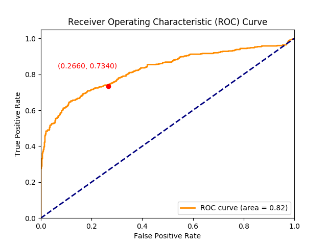


**Question 2:**

What errors does the 4FS algorithm make with pairs that actually match and with pairs that should not match? Provide some visual examples. Based on the information obtained from the article describing the 4SF algorithm, assess (or provide your opinion) on the reasons for these errors.

**Answer 2:**

The algorithm 4SF operates based on the use of the LBP descriptor and the projection method into a subspace. When comparing pairs of images that actually match, errors leading to incorrect classification can occur. These errors may be due to various factors such as the diversity of expressions on faces, lighting conditions, as well as possible uneven alignment of faces. To gain a better understanding of the nature of these errors, we can examine some visual examples.

Visual examples of errors in pairs that actually match:

- A case where faces have different expressions or lighting conditions.
- A case where faces are turned at different angles.
- A case where faces are partially obscured (e.g., with a mouth or nose shield).

Visual examples of errors in pairs that should not match:

- A case where faces have identical expressions but belong to different individuals.
- A case where faces are very similar but do not belong to the same person.

Based on information from the article describing the 4SF algorithm, it can be inferred that errors in matching may be due to limitations of the LBP descriptor in capturing complex facial features. Additionally, the subspace projection method may not always be robust enough to handle various scenarios, leading to misclassification in certain pairs of images.

Here are a few examples of false negative and false positive recognitions:

***False negative example 1***

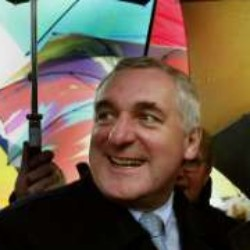
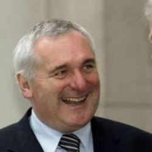

***False negative example 2***


***False positive example 1***


***False positive example 2***


**Question 3:**

Present the procedure for calculating HOG descriptors that you used (parameter values, use of overlap, normalization, method of facial region cropping, ...) and the process of training the SVM classifier (what were the input data for training, what type of normalization was used, ...).

**Answer 3:**

***HOG descriptors***

In crafting our HOG descriptors, we took a methodical two-step approach:

1. First off, we carved up the image into neat little cells, each measuring 20x20 pixels. These cells served as the foundation for calculating the Histogram of Oriented Gradients (HOG).

2. Following that, we organized these cells into blocks during the HOG computation, applying normalization to each block. Our preference was for blocks that encompassed 2x2 cells, ensuring a systematic normalization process.

With our HOG descriptors at the ready, we united them for each image pair. This amalgamation involved either adding or taking the absolute difference of the HOG descriptors, followed by another round of normalization.

***Training the SVM***

Shifting gears to training our Support Vector Machine (SVM) classifier, we opted for the SVC version within the scikit-learn module. Adhering to the default training approach, we fine-tuned the SVC parameters through a grid parameter search. With this we tried to improve the accuracy of the SVM which proved to be quite successful.


**Question 4:**

What is the equal error rate (EER) for the tested algorithm on this database and in the selected test?

**Answer 4:**

Having experimented with various Support Vector Classifier (SVC) configurations, the outcomes exhibited considerable variability, primarily influenced by the choice of the kernel as the foundation and whether we subtracted or added the HOG features. Additionally, we explored two distinct approaches for face region extraction—manual cropping and cropping facilitated by the OpenCV Haar-cascade. The ensuing results are presented below (ERR is represented by the red point on the graph, more specificaly the x-axis coordinate):

***Face detections done with manual croping***

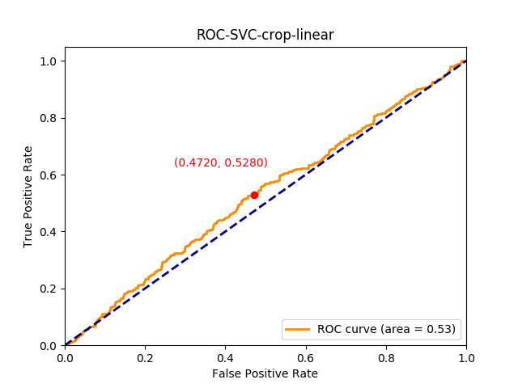
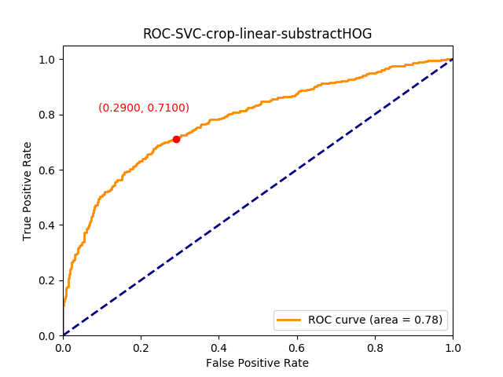


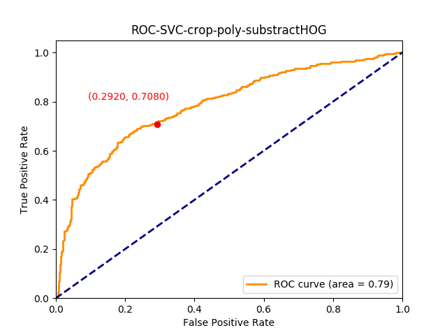

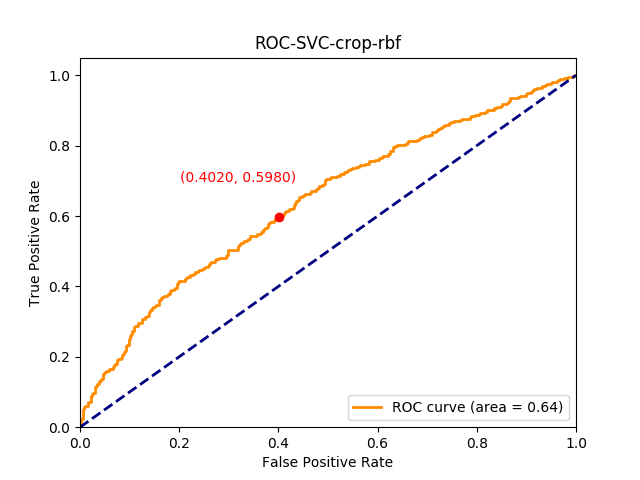
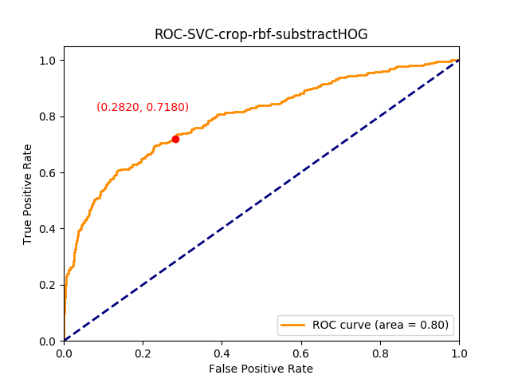

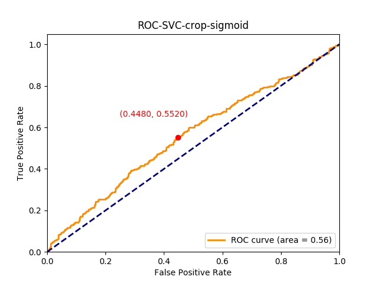


***Face detections done with OpenCV Haarcascade***

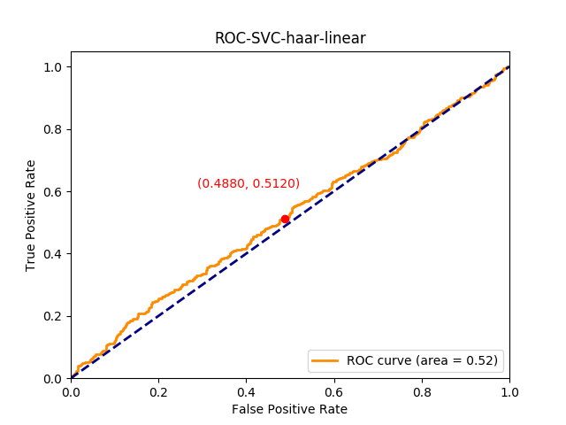
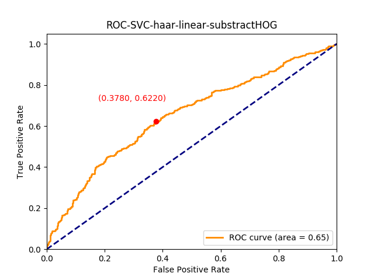


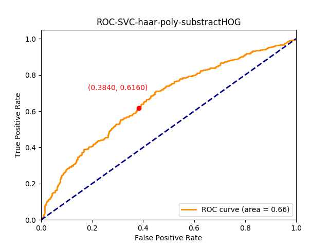

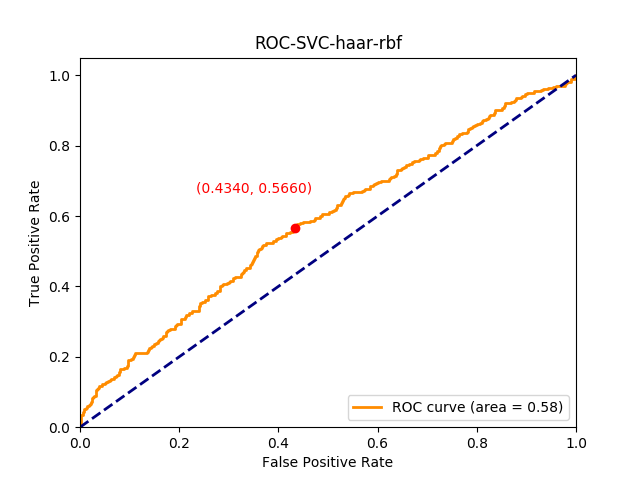
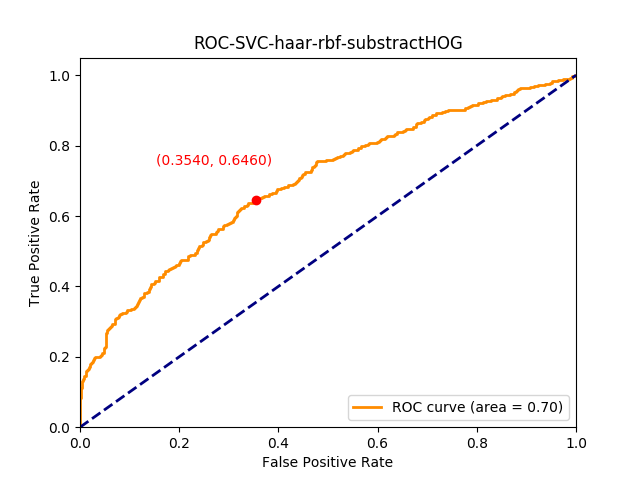


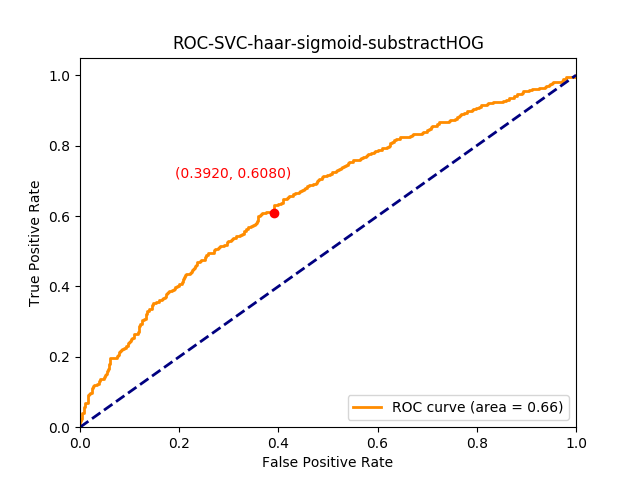


**Question 5:**

What errors does the algorithm make with pairs that actually match and with pairs that should not match? Provide some visual examples. Based on knowledge of HOG descriptors and SVM classifiers, give your opinion on the reasons for these errors.

**Answer 5:**

The success of the SVC classifier in the above case is dependent on many factors which might contribute to the overall result. Error contributions can be split among the following causes:

- HOG descriptor limitations
- SVC hyperparameter tuning
- SVC overfitting or underfitting

If we look at the HOG descriptors from the problem of using them for face recognition, the following problems might occur:

1. **Sensitivity to Image Quality:**
   - HOG descriptors are sensitive to image quality, and variations in lighting conditions can significantly impact their performance. Changes in illumination may cause the descriptor to emphasize or de-emphasize certain features, leading to recognition errors.

2. **Limited Handling of Facial Expressions:**
   - HOG descriptors are less effective in capturing subtle changes in facial expressions. Since they focus on local gradients and edge orientations, they may not adequately represent the dynamic aspects of facial expressions crucial for recognizing individuals in different emotional states.

3. **Pose Sensitivity:**
   - HOG descriptors are sensitive to variations in facial pose. Large head rotations or tilts can result in different gradient patterns, making it challenging for HOG-based systems to recognize faces across a wide range of poses.

4. **Geometric Deformations:**
   - HOG descriptors assume that local shape information can be represented by local intensity gradients. However, they may not handle well the geometric deformations that can occur in faces due to factors such as aging or plastic surgery.

5. **Uniform Texture Representation:**
   - HOG descriptors may not effectively capture facial areas with relatively uniform textures, such as the forehead or cheeks. In regions lacking distinctive edge information, the descriptor might not provide discriminative features.

6. **Computationally Intensive:**
   - Computing HOG descriptors for large images or in real-time applications can be computationally intensive. This may limit the speed and efficiency of face recognition systems, especially in scenarios where quick responses are crucial.

7. **Dependency on Parameter Settings:**
   - The performance of HOG descriptors is influenced by parameter settings such as the cell size, block size, and the number of histogram bins. Selecting appropriate parameters is essential for achieving optimal performance, and suboptimal choices can lead to reduced accuracy.

If we then look at the problems regarding the SVC:

- Using SVC hyperparameter tuning we probably wouldn't find the best parameters in our limited scope of testing; therefore, this approach would have to be improved.
- The SVM classifier may either overfit the training data, capturing noise rather than genuine patterns, or underfit the training data, failing to capture the complexities of facial variations.

Here are some of the practical examples in which pairs were not recognized correctly for each SVC variation:

<!------------- CROP HOG ADDITION ---------------->
***Manual cropping with linear kernel and HOG addition***


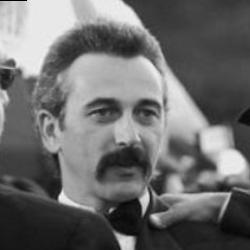
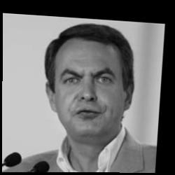


***Manual croping with polynomial kernel and HOG addition***

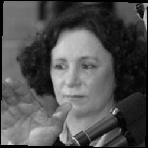
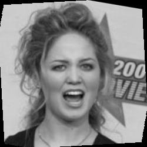

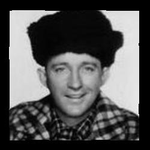
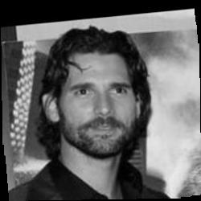


***Manual croping with radial basis function kernel and HOG addition***


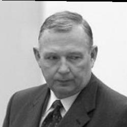

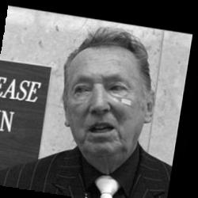
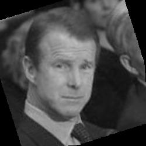


***Manual croping with sigmoid kernel and HOG addition***

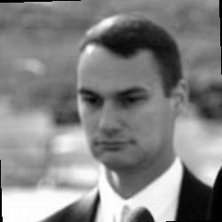


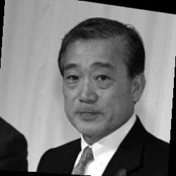


<!------------- CROP ABS HOG DIFFERENCE ---------------->
***Manual croping with linear kernel and absolute HOG difference***

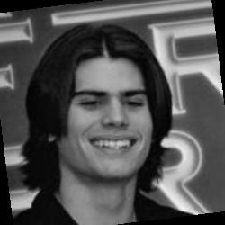
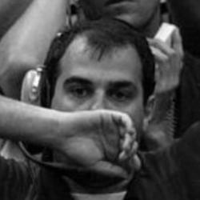

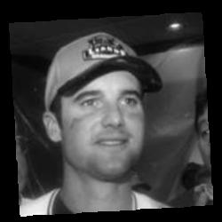
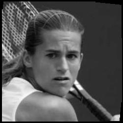


***Manual croping with polynomial kernel and HOG addition***


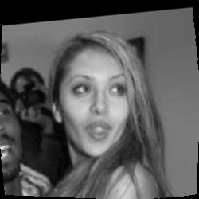

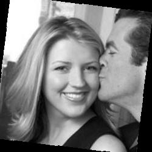
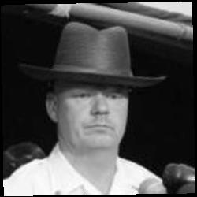


***Manual croping with radial basis function kernel and HOG addition***


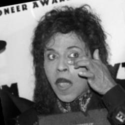

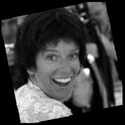
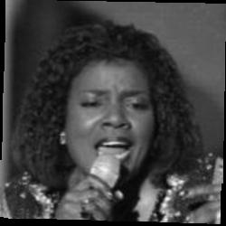


***Manual croping with sigmoid kernel and HOG addition***

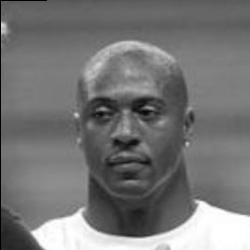


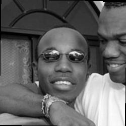


<!------------- CV HOG ADDITION ---------------->
***Haarcascade detection with linear kernel and HOG addition***

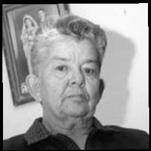
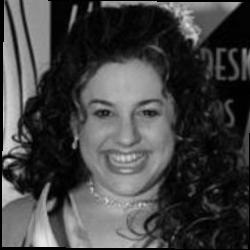

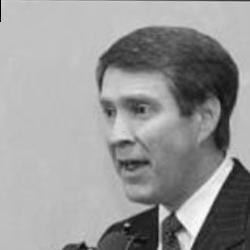
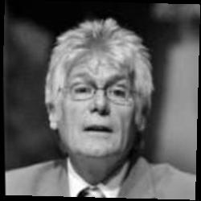


***Haarcascade detection with polynomial kernel and HOG addition***

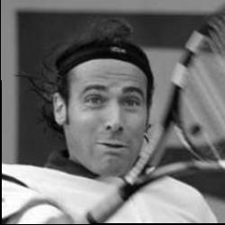
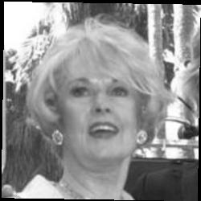

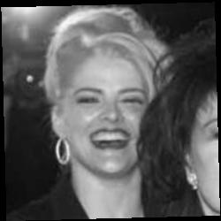


***Haarcascade detection with radial basis function kernel and HOG addition***

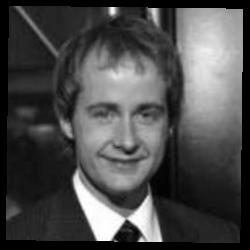
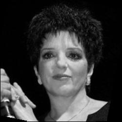


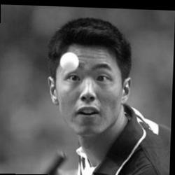


***Haarcascade detection with sigmoid kernel and HOG addition***


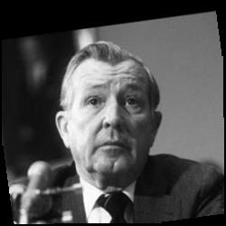


<!------------- CV ABS HOG DIFFERENCE ---------------->
***Haarcascade detection with linear kernel and absolute HOG difference***

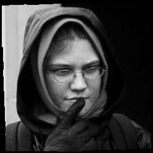


***Haarcascade detection with polynomial kernel and HOG addition***


***Haarcascade detection with radial basis function kernel and HOG addition***


***Haarcascade detection with sigmoid kernel and HOG addition***


**Question 6:**

Which of the two tested algorithms proved to be more effective on this dataset?

**Answer 6:**

When we first experimented comparing the 4SF algorithm with SVC we tought that the 4SF would in the end be a lot better, but after picking the correct kernel for the SVC and the use of hyperparameter optimiztion the algorithms came pretty close considering their effectiveness. Bellow are the receiver operating curves (ROCs) of the original 4SF algorithm and the best results we received from the SVC.


**Question 7:**

If you were able to develop a better face recognition system, what challenges of recognition would you focus on?

**Answer 7:**

In the context of the OpenBR and SVM-based face verification problem, if I were to develop a better face recognition system, I would primarily address the following challenges:

### 1. Handling Variability in Pose and Expression
- **Approach:** Enhance the algorithm's capability to recognize faces under various poses and expressions.
- **Insights:** Investigate advanced pose-invariant features in HOG descriptors and fine-tune SVM configurations to improve performance under diverse facial orientations.

### 2. Illumination Robustness
- **Approach:** Improve recognition under varying lighting conditions.
- **Insights:** Investigate preprocessing techniques within OpenBR to normalize illumination variations. Optimize SVM kernels to handle changes in lighting effectively.

### 3. Partial Occlusion
- **Approach:** Develop strategies to recognize partially occluded faces.
- **Insights:** Leverage OpenBR's feature extraction methods that are less sensitive to occlusion. Explore SVM configurations within OpenBR for better handling of partially obscured facial features.

### 4. Aging and Temporal Changes
- **Approach:** Enhance recognition performance considering facial changes due to aging.
- **Insights:** Utilize OpenBR tools for age progression/regression in HOG descriptors. Optimize SVM parameters to account for temporal variations in facial features.

### 5. Adverse Environmental Conditions
- **Approach:** Strengthen the system to perform well in challenging environments.
- **Insights:** Explore robust preprocessing techniques in OpenBR to mitigate adverse conditions. Fine-tune SVM configurations for optimal performance in diverse scenarios.

### 6. Ethnic and Gender Diversity
- **Approach:** Improve system inclusivity across diverse ethnicities and genders.
- **Insights:** Train the model on diverse datasets using OpenBR functionalities. Optimize SVM parameters for unbiased and inclusive recognition.

### 7. Security and Privacy Considerations
- **Approach:** Implement measures to address security and privacy concerns.
- **Insights:** Enhance secure storage and transmission protocols in OpenBR. Consider SVM configurations that prioritize security and privacy without compromising recognition accuracy.

### 8. Real-Time Processing
- **Approach:** Optimize algorithms for real-time face recognition.
- **Insights:** Utilize OpenBR's efficiency features and explore SVM configurations for rapid and reliable real-time processing.

### 9. Adversarial Attack Resilience
- **Approach:** Strengthen the system against adversarial attacks.
- **Insights:** Incorporate OpenBR mechanisms to handle adversarial attacks. Explore SVM configurations with adversarial training to enhance system resilience.

### 10. Addressing Data Bias and Ensuring Fairness
- **Approach:** Address biases in training data and ensure fairness in recognition.
- **Insights:** Scrutinize training datasets for biases using OpenBR's dataset analysis tools. Implement strategies for balanced representation. Continually assess the fairness of the system and SVM configurations.

By focusing on these challenges and integrating advanced features and optimizations within OpenBR and SVM, the face recognition system can be significantly enhanced to deliver superior performance across various scenarios and demographics.
