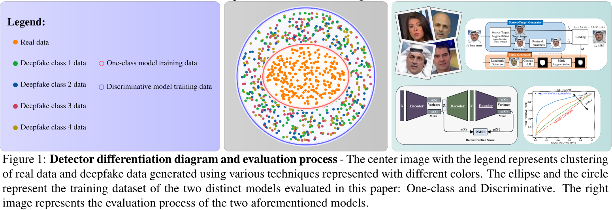
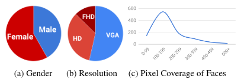
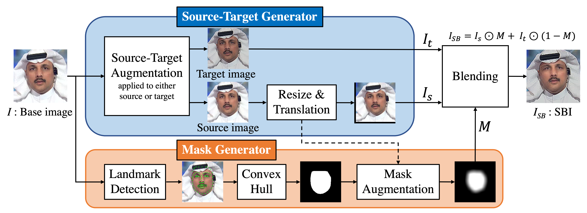
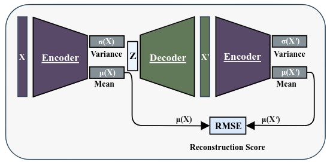
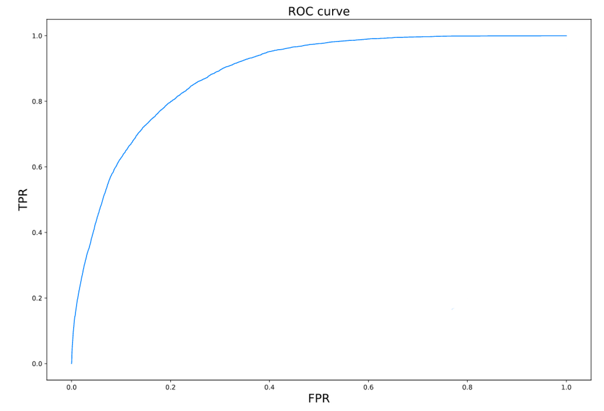
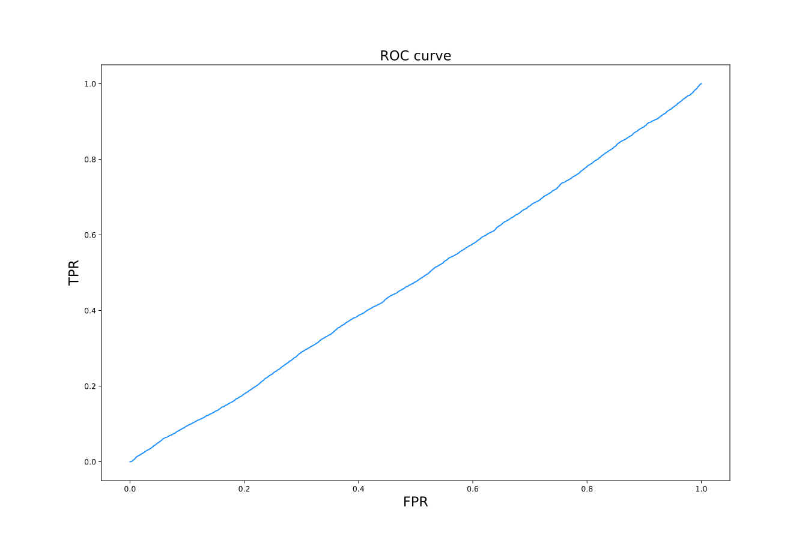

# DeepFake detection as an anomaly detection problem




## Project structure

The folder structure of the project is built around the detectors and datasets available in the respective folders. If you want to use this project correctly cite the dataset authors and other various authors that have generated or contributed to the possibility of even creating this work. 

The project structure is the following:

- **docs** - *Documentation folder with assets and a full technical report on the exercise*

- **datasets** - *Datasets available for use, currently works with the FaceForensics++ dataset*

- **detectors** - *Detectors available for use, currently works for OC-FD and SBI detectors*

- **detector-output** - *Generated output that we have gotten from the aformentioned detectors*

- **evaluation-scripts** - *Automatic deployment scripts for generating volumes in the datasets folder and building/running the detector images*

- **.env** - *General configuration environment file, parameters used in evaluation-scripts folder*
    

## Abstract

Due to advances in computer vision and most importantly deep learning considerable advances have been made in the area of photo realistic face manipulation. So-called deepfakes represent manipulated videos of faces where the original appearance of a person is replaced with the appearance of some selected target face. These deepfakes represent a considerable societal problem, as they can be used to produce fake news, spread misinformation and adversely affect the trust of people in news media coverage and reporting. As a result, research effort is being directed towards designing deepfake detectors that can reliably detect whether an image or video is fake or real. Several such detectors have been proposed in the literature, but these still exhibit difficulties in generalization performance. In most cases, the detectors work well for detecting a specific form of deepfake, generated with some specific algorithm, but fail to generalize to new, unseen deepfake types. This is best shown by cross-dataset experiments, or cross-manipulation type of experiments, where a trained detector works well on one dataset/method, but not on another. In this paper we try to evaluate a deepfake detector around deep learning models trained for anomaly detection and compare it to a discriminatively trained detector. We tested a discriminatively trained detector called Self blended images (SBI) and a one class deepfake detector called OC-FakeDect (OC-FD) and test them on an aligned FaceForensics++ dataset. We achieved good detection results on the Self blended images detector and bad performance on the OC-FakeDect detector. As such we firther investigated the causes and compared the original results from studies, which showed that both detectors can display a solid performance and as such the one-class type of detectors can be a viable option towards a more generalized deepfake detection.


## Introduction

Deepfakes are a relatively recent problem that began gaining widespread attention in the years of 2017/2018. Primarily they were intended for creating realistic but fake videos. Quickly after gaining traction it was clear that misuse could appear therefore researchers, technology companies, and policymakers tried to mitigate their impact. As the field evolved many different techniques to detection appeared, however in our paper we will focus on discriminatively trained and one-class detection models.

Discriminatively based models leverage the power of machine learning to differentiate between authentic and synthetic content by learning patterns and features inherent in both. These models are trained on diverse datasets comprised of genuine and manipulated data, empowering them to discern subtle discrepancies that betray the artificial nature of deep fakes. However they fail at generalizing their performance across the board as new deepfake generating techniques appear.

On the other hand, one-class detection models take a more singular approach, focusing solely on learning the characteristics of genuine data. By establishing a baseline of what is considered real or normal, these models classify any deviation from this norm as anomalous, thereby flagging potential instances as deepfakes. These models may be more appropriate for generalizing performance since they are based on only real data instead of the fake data.

As we can see there are currently two relatively different approaches to model training design available and as such we try to address this gap of comparing the two side by side and determining the effectiveness of such models. To evaluate them we use a technique called cross-manipulation. Cross-manipulation experiments expose the models to a diverse set of manipulated photos generated using various techniques. This could include deepfakes created with different algorithms, varying degrees of sophistication, and different types of visual or audio manipulation. Some common performance meassures  that are used in such experiments are true/false positive rate (TPR/FPR) and true/false negative rate (TNR/FNR), receiver operating curve (ROC), area under the ROC (AUC-ROC), precision-recall (PR) curve, area under the PR curve (AUC-PR) and many others [18] [24] [1]. These performance meassures provide a comprehensive view of the model's ability to differentiate between genuine and synthetic content under diverse conditions [21]. 


## Realted work

The related works regarding deepfakes is divided into three sections. First we explain the currently available and relevant datasets in the field, then we move to the commonly known discriminatively trained deepfake detection models, which are currently the most standard way to approaching deepfake detection, finally we explain the structure of one-class models and their availability since they are used as a new approach to generalizing deepfake detection performance [22].

### Deepfake datasets

The continuous proliferation of deepfakes on the internet underscores the critical need for advanced datasets in the field. As generation methods evolve, existing datasets
face challenges such as low-quality synthesized faces, visible splicing boundaries, color mismatch, remnants of the original face, and inconsistent synthesized face orientations. Addressing these issues is crucial for developing effective detection models, particularly for scenarios in the wild [17]. Additionally, the datasets currently available encounter challenges related to the quantity and modernity of the generation approaches [3]. To mitigate potential biases and improve generalization, some datasets incorporate internet-derived data with careful consideration of its quality and relevance [33]. The dataset table 1 summarizes the notable image and video datasets, each contributing uniquely to the ongoing efforts in the field.

| **Dataset**                   | **Real images** | **Deepfake images** | **Real videos** | **Deepfake videos** | **Generation techniques** | **Low Resolution** | **Source**                           |
|-------------------------------|------------------|---------------------|-----------------|---------------------|---------------------------|---------------------|---------------------------------------|
| EBV \cite{EBV-ds}             | no               | no                  | 50              | 50                  | 1                         | no                  | YouTube                               |
| UADFV \cite{UADFV-ds}         | 241              | 252                 | 49              | 49                  | 1                         | no                  | YouTube                               |
| Celeb-DF \cite{CELEBDF-ds}    | no               | no                  | 590             | 5,639               | 1                         | no                  | YouTube                               |
| FaceForensics++ \cite{FF-ds}   | no               | no                  | 1,000           | 4,000               | 4                         | no                  | YouTube                               |
| DFDC \cite{DFDC-ds}            | no               | no                  | 23,654          | 104,500             | 8                         | no                  | Self Recording                        |
| DeepfakeTIMIT \cite{DFTIMIT-ds}| no               | no                  | 320             | 640                 | 2                         | yes                | VidTIMIT                              |
| WildDeepfake \cite{WildDF-ds}  | no               | no                  | 707             | 707                 | Not known                 | no                  | Internet                              |
| OpenForensics \cite{OpenForensics-ds} | 45,473   | 70,325              | no              | no                  | 1                         | no                  | Google Open Images                    |
| FFHQ \cite{FFHQ-ds}            | 70,000           | 0                   | no              | no                  | 0                         | no                  | Flickr                                |
| DFFD \cite{DFFD-ds}            | 58,703           | 240,336             | 1,000           | 3,000               | 7                         | Both included       | FFHQ, FF++, CelebA                    |
| FFIW-10K \cite{FFIW-ds}        | no               | no                  | 0               | 10,000              | 3                         | no                  | YouTube                               |
| DeeperForensics-1.0 \cite{DEEPERFORENSICS-ds} | no  | no                  | 10,000          | 50,000              | 1                         | no                  | Self Recording                        |
| ForgeryNet \cite{FORGERYNET-ds}| 1,438,201        | 1,457,861           | 99,630          | 121,617             | 15                        | Both included       | CREMA-D, RAVDESS, VoxCeleb2, AVSpeech |


### Discriminatively trained detection models

Discriminatively trained detection models are fundamentally rooted in the different utilization of neural networks or other deep learning architectures. By leveraging a
diverse array of manipulated content, these models demonstrate a degree of resilience against well-known manipulation methods. Typically operating within a binary classification framework, these models categorize input data into two distinct classes: real or fake. The decision boundary established during the training phase emerges as an important factor influencing the model’s capacity to render accurate predictions. Despite their notable success in detecting various types of deepfakes, these models may confront difficulties when addressing new deepfake generation methods or contending with adversarial attacks engineered to exploit vulnerabilities within the learned patterns [5]. As discriminanetively trained detectors are widely used there are quite a few different approaches regarding them. First we have the standard classification models such as XceptionNet and VGG16 with high detection scores as achieved in the study carried out by Dang et al. in [2]. Following them are two-stream networks, intended for use on videos, which consist of two parallel streams, each specializing in capturing different aspects of the input data. The two primary streams are the spatial stream, which focuses on static one frame information like facial features, and the temporal stream, which focuses on capturing dynamic information over time like facial movement. Good results with a two-stream model were achieved by the study from Hu et al. in [7]. Similar are attention models which focus on a specific regions and assign different importance to different facial regions. As such they are good at extracting where the key features separating fake and real data are located. Using this approach good results where achieved by Zhao et al. in a study [31]. Moving towards a more generalized approach we have capsule networks using CNNs that capture hierarchical relationship in data. Since they are more invariant towards transformations for using groups of neurons called capsules they allow for more robustness when detecting deepfakes. Study by Khalil et al. in [12] has shown solid results. Joining all different aformentioned approaches we have ensemble models, as an approach to better generalization, which stack different models and based on their predictions determine whether the input data is real or fake. Using this approach one of the best results were achieved by Rana et al. in the study [19].

### One-class detection models

Specialized in identifying anomalies and outliers, one-class type detectors offer a distinctive approach to detection models. These detectors excel in resilience against
well-known manipulation techniques and are specifically designed to handle novel synthetic content challenges. Operating within a univariate classification framework, they
categorize input data into a single class, shaping decision boundaries during training. Notably, these detectors are less likely to face challenges with new methods, as they are trained solely on one class of real data [25]. Since they are a relatively new approach, they are less common and as such there are only a few implementations available. One such model is the OneClass-FakeDect model developed by Khalid et al. [11]. This model uses a one-class Variational Autoencoder (VAE) to train only on real face images and detects non-real images such as deepfakes by treating them as anomalies. Using this type of model can be an advantage in case we already know the real data that is being evaluated. A simmilar approach is taken by the SeeABLE detector created by Larue et al. [14]. The detector first generates local image perturbations (referred to as soft-discrepancies) and then pushes the perturbed faces towards predefined prototypes using a novel regression-based bounded contrastive loss. To strengthen the generalization performance of SeeABLE to unknown deepfake types, researches generated a rich set of soft discrepancies and train the detector: to localize, which part of
the face was modified, and to identify the alteration type.


## Methodology

In this section we present our methodology for evaluating the performance of different types of deepfake detection models. We first introduce a dataset on which the models are evaluated and then follow with a general evaluation methodology used for each detector output.

### Used dataset

We can see that the choice for different deepfake datasets is very diverse with each dataset offering a unique advantage over the other and its use case. For our research we
used the FaceForensics++ dataset [20] as it offers over 1.8 million manipulated images, which are primarily split into real and deepfake data. The deepfake benchmark is based
on 4 unique methods: DeepFakes [4], Face2Face [27], FaceSwap [28] and NeuralTextures [26] as prominent representatives for facial manipulations at random compression level and size.



Figure 2: Statistics of the FaceForensics++ real videos (Sequences). VGA denotes 480p, HD denotes 720p, and FHD denotes 1080p resolution of videos. The graph (c) shows
the number of sequences (y-axis) with given bounding box pixel height (x-axis)

### Used models

In our research we utilize a discriminatively trained and a one-class detection model. If the models are already pre-trained we use the pretrained model, otherwise we train
them using the default methods specified for the model. Following are the description for each of the two models.

#### Self Blended Images (SBI)

SBIs are generated by blending pseudo source and target images from single pristine images, reproducing common forgery artifacts (e.g., blending boundaries and statistical
inconsistencies between source and target images). The key idea behind SBIs is that more general and hardly recognizable fake samples encourage classifiers to learn generic and robust representations without overfitting to manipulation-specific artifacts. In particular, on DFDC and DFDCP where existing methods suffer from the domain gap between the training and test sets, this approach outperforms the baseline by 4.90% and 11.78% points in the cross-dataset evaluation, respectively. [23]



Figure 3: **Overview of generating an SBI** A base image I is input into the source-target generator (STG) and mask generator (MG). STG generates pseudo source and target
images from the base image using some image transformations, whereas MG generates a blending mask from the facial landmarks and deforms it to increase the diversity of
the mask. Finally, the source and target images are blended with the mask.

#### One Class Fake-Dect (OC-FD)

The OC-FakeDect proposes the usage a one-class Variational Autoencoder (VAE) to train only on real face images and detect non-real images such as deepfakes by treating
them as anomalies. The preliminary result shows that this one class-based approach can be promising when detecting Deepfakes, achieving a 97.5% accuracy on the Neural-Textures data of the well-known FaceForensics++ benchmark dataset without using any fake images for the training process. The preliminary results showed a 97.5% accuracy on the NeuralTextures data of the FaceForensics++ dataset without using any fake images for the training process. [11]



Figure 4: **OC-FakeDect-2 architecture.** Variational autoencoder used in the model architecture with the RMSE reconstruction score calculation.

### Evaluation methodology

The default output of each detector is a binary representation for the given image indicating whether the image represents a deepfake or not. Using the predefined labels that tell whether the image is or is not a deepfake, we can calculate the true/false positive rate $`TPR/FPR`$ and the true/false negative rate $`TNR/FNR`$.

```math
TPR = \frac{True\ Positives}{True\ Positives + False\ Negatives} = 1 - FNR
```
```math
FNR = \frac{False\ Negatives}{True\ Positives + False\ Negatives} = 1 - TPR
```

```math
TNR = \frac{True\ Negatives}{True\ Negatives + False\ Positives} = 1 - FPR
```
```math
FPR = \frac{False\ Positives}{False\ Positives + True\ Negatives} = 1 - TNR
```

After this, we can calculate the receiver-operating-characteristic (ROC) curve and the area under it (AUC-ROC). The ROC curve visually represents the trade-off between True Positive Rate (sensitivity) and False Positive Rate at different classification thresholds. It is especially useful for assessing a classifier's ability to discriminate between classes, providing a concise summary of its performance characteristics. To calculate it, we have to vary the threshold $`T_i`$ within the detector threshold range $`THR_{det}`$ to calculate the above four performance measures for different thresholds. As two of the above measures are mutually exclusive, we use only one pair of them, specifically the $`FPR`$ and $`TPR`$ values. The ROC curve is then defined as a function of $`FPR(T_i)`$ on the x-axis and $`TPR(T_i)`$ on the y-axis, representing the performance of a detector.

```math
\forall \ T_i \in THR_{det}\ \ \exists\ \ FPR(T_i), TPR(T_i)
```
```math
\forall \ FPR(T_i),\ TPR(T_i) \quad \exists \quad f_{ROC}(FPR(T_i)) = TPR(T_i)
```

Area under the curve for a ROC is then defined as an integral over the whole threshold range of the curve.

```math
AUC_{ROC} = \int_{T_0}^{T_k} TPR(T_i) \ \ dFPR(T_i)
```

For balancing the values of $`FPR`$ and $`FNR`$ on the ROC curve, we use the equal error rate $`EER`$, which represents the point on the curve where the values of $`FPR`$ and $`TPR`$ are the same.

```math
\forall FPR(T_i),\ FNR(T_i) \quad \exists \quad m: \ FPR(T_m) = FNR(T_m)
```
```math
\implies EER\ =\ {FPR(T_m), 1 - TPR(T_m)} 
```

A similar performance measure to the ROC curve is the precision-recall (PR) curve. The PR curve is a graphical representation of the trade-off between precision and recall for different classification thresholds. The PR curve is especially useful when dealing with imbalanced datasets, where one class significantly outnumbers the other. First, we have to calculate the precision $`P`$ and recall $`R`$.

```math
P = \frac{True\ Positives}{True\ Positives + False\ Positives}
```
```math
R = \frac{True\ Positives}{True\ Positives + False\ Negatives} = TPR
```

Similar to the ROC curve, we vary the threshold $`T_i`$ within the detected threshold range $`THR_{det}`$ to calculate the precision $`P`$, recall $`R`$, and $`F1`$ score.

```math
\forall \ T_i \in THR_{det}\ \ \exists\ \ P(T_i),\ R(T_i)
```
```math
\forall \ P(T_i),\ R(T_i) \quad \exists \quad f_{PR}(R(T_i)) = P(T_i)
```

```math
F1 = 2 \cdot \frac{P \cdot R}{P + R}
```

## Experiments

Here we present our experimental results training and testing the OC-FakeDect detector and only testing the SBI detector since it was pretrained. As a baseline for performance we will reference the data from a simmilar study [8] writen by Ivanovska et al. as it provides a similar insight to the topic as ours.

| **Stage** | **Training dataset** | **Testing dataset** | **ResNet50 (discriminative)** | **GANomaly (one-class)** |
|------------|-----------------------|----------------------|-------------------------------|---------------------------|
| **Matched dataset** | UADFV | UADFV | 0.947 | 0.880 |
| | FF-FS | FF-FS | 0.966 | 0.868 |
| | Celeb-DF | Celeb-DF | 0.938 | 0.746 |
| **Cross dataset** | UADFV FF-FS Celeb-DF | FF-FS Celeb-DF UADFV Celeb-DF UADFV FF-Fs | 0.622 0.531 0.763 | 0.768 0.704 0.794 |
| | UADFV FF-FS | UADFV Celeb-DF | 0.561 | 0.608 |
| | Celeb-DF UADFV | UADFV FF-Fs | 0.574 | 0.772 |
| | | | 0.527 | 0.680 |

### Data preprocessing

All datasets described in Section 2.1 consist mostly of videos with a lot of redundant information, therefore we used an already preprocessed FaceForensics++ dataset that
did the following. First we extracted a few frames from each video and detect faces using the MTCNN face detector proposed by Zhang et al. in [29] to reduce the amount of
redundant information in an image. This algorithm returns coordinates of the bounding boxes containing a face, which are then used to crop out rectangular face areas. False positives are manually removed from the final set of images. Finally we split the dataset into 3 parts training, validation and testing with both deepfake and real images separated. In the experiments we followed the 80/20 split rule therefore 80% of our samples were used in training and 20% were used in testing the detectors

### Methods

**SBI** [23] detector testing was done using the default pretrained model with the FF-raw (Check the paper for specifics) weights since they displayed best performance. We used the prepared inference script for the images in our dataset and executed each inference pass separately. Since this detector was only tested we used the testing part of the dataset provided.

**OC-FakeDect** [11] detector training was done using the Adam gradient based optimization method with an initial learning rate of 0.001, batch size of 650, 300 epochs and a
scheduler with an implemented early stop. We used all parts of the dataset, however for the training we need to point out that only the real images were used and testing was done using the best weights that the training procedure yielded.

### Experimental results

The results of our training and testing methods described above are shown in the table bellow. 

| Detector      | AUC  | Precision | Recall | F1   |
|---------------|------|-----------|--------|------|
| SBI           | 0.91 | 0.81      | 1.00   | 0.90 |
| OC-FakeDect2  | 0.50 | 0.19      | 1.00   | 0.32 |

As we can see the SBI detector performs within reason, however the OC-FakeDect detector does not in regards to the original studies [23] [11]. Below we also present the ROCs regarding both detectors 5. In light of the results we did not proceed with the cross-manipulation testing since it would be pointless if one of the detectors did not perform as expected or was wrongfully trained. As such we repeatedly trained the one-class detector multiple times with different variations of parameters which could potentially yield promising results, however unsuccessfully. Since this is the final result we can discuss potential problems with the training process of the one-class detector in the ablation study.





If we were to compare the original studies between each other [23] [11] we would conclude that the performance of the two detectors is comparable and as such one-class type
of detectors would be a viable option to generalize the performance to newer, never seen before, deepfake generation methods. However we have to keep in mind the difference
between these results as one-class detectors still fall short in certain detection tests and as such should be improved.

| Detector         | Training dataset      | Testing dataset             | AUC (%) |
|------------------|-----------------------|-----------------------------|---------|
| SBI              | FF++                  | FF++                        | 99.64   |
| SBI              | FF++                  | Celeb-DF                    | 93.18   |
| SBI              | FF++                  | DFDC                        | 86.15   |
| SBI              | FF++                  | FFIW-10K                    | 84.83   |
| OC-FakeDect2     | FF++ (real)           | NeuralTextures (FF++)       | 97.50   |
| OC-FakeDect2     | FF++ (real)           | DeepFakes (FF++)            | 88.40   |
| OC-FakeDect2     | FF++ (real)           | FaceSwap (FF++)             | 86.10   |
| OC-FakeDect2     | FF++ (real)           | Face2Face (FF++)            | 71.20   |
| OC-FakeDect2     | FF++ (real)           | DFD (FF++)                  | 98.20   |


## Ablation study

In the process of varying the parameters of the training process we tried varying the number of epochs as well as changing the batch size and addin or removing the scheduler
with early stop completely. The results we got were mostly the same. The original study that presents the OC-FakeDect detector [11] is tested only on one type of deepfake generation method called NeuralTextures of the FaceForensics++ dataset and as such might not preform that well on other generation methods, however this issue might not be the root cause for the training problem. The main issu might lie in the training process itself since the original implementation requires 2000 epochs without any early stoping to properly train the detector on only one generation method of the four provided by the FaceForensics++ dataset. As such we could conclude that if we want to properly train the detector on all different types of generation methods, the number of epochs required could potentially be very high. As such we still believe that the mistake is on our part and with proper training the results from the original study can be achieved.

## Limitations

### Self Blended Images (SBI) [23]

First we have to mention here that the main limitation of this model is that it can only run on a system with a GPU, because of the model‘s dependencies. As such the original
code-base is relatively new since the detector is state-of-the-art and as such we discovered a few bugs trying to run it (Open PR) and had to fix them in the process of testing the model.

### OC-FakeDect (OC-FD) [11]

As mentioned in the ablation study and experimental methods we limited the number of epochs and added a scheduler with early stoping primarily because of the training time
the detector took. When we first ran it with 2000 epochs as specified in the study the run took about 4 days to complete running on an NVIDIA’s‘s 10 series mid-range graph-
ics card. If we put this into perspective of our time frame dedicated to this research task the training process took a lot of time.

## Conclusion

This paper presented an experimental study comparing the deepfake detection performance comparing a discriminatively trained Self blended images detector and one-class
OC-FakeDect detector. Using a dataset benchmark provided by the FaceForensics++ we conducted a matched dataset experiment on the two detectors. Upon testing the one-class detector our results yielded a suboptimal performance, therefore we did not proceed with executing cross-dataset experiments, but rather focused on the issues regarding the training process of the one-class detector. In the matched dataset tests we achieved good results on the Self blended images detector and bad results on the OC-FakeDect detector. However when comparing the results from the original studies we concluded that both types of detectors display solid performance and are a viable option for researching further. As such one-class detectors do display good generalization performance and with further development can be a way towards a generalized deepfake detection.

## References

[1] R. Arbel and L. Rokach. Classifier evaluation under limited resources. *Pattern Recognition Letters*, 27(14):1619–1631, 2006.

[2] H. Dang, F. Liu, J. Stehouwer, X. Liu, and A. K. Jain. On the detection of digital face manipulation. In *Proceedings of the IEEE/CVF Conference on Computer Vision and Pattern Recognition*, pages 5781–5790, 2020.

[3] B. Dolhansky, J. Bitton, B. Pflaum, J. Lu, R. Howes, M. Wang, and C. C. Ferrer. The deepfake detection challenge (dfdc) dataset. *arXiv preprint arXiv:2006.07397*, 2020.

[4] k. e. a. Github users: torzdf, kvrooman. Deep-fakes github. [https://github.com/deepfakes/faceswap](https://github.com/deepfakes/faceswap). Accessed: 2024-01-14.

[5] L. Guarnera, O. Giudice, and S. Battiato. Fighting deepfake by exposing the convolutional traces on images. *IEEE Access*, 8:165085–165098, 2020.

[6] Y. He, B. Gan, S. Chen, Y. Zhou, G. Yin, L. Song, L. Sheng, J. Shao, and Z. Liu. Forgerynet: A versatile benchmark for comprehensive forgery analysis. In *Proceedings of the IEEE/CVF conference on computer vision and pattern recognition*, pages 4360–4369, 2021.

[7] J. Hu, X. Liao, W. Wang, and Z. Qin. Detecting compressed deepfake videos in social networks using frame-temporality two-stream convolutional network. *IEEE Transactions on Circuits and Systems for Video Technology*, 32(3):1089–1102, 2021.

[8] M. Ivanovska and V. ˇStruc. A comparative study on discriminative and one–class learning models for deepfake detection.

[9] L. Jiang, R. Li, W. Wu, C. Qian, and C. C. Loy. Deeperforensics-1.0: A large-scale dataset for real-world face forgery detection. In *Proceedings of the IEEE/CVF conference on computer vision and pattern recognition*, pages 2889–2898, 2020.

[10] T. Karras, S. Laine, and T. Aila. A style-based generator architecture for generative adversarial networks. In *Proceedings of the IEEE/CVF conference on computer vision and pattern recognition*, pages 4401–4410, 2019.

[11] H. Khalid and S. S. Woo. Oc-fakedect: Classifying deepfakes using one-class variational autoencoder. In *Proceedings of the IEEE/CVF conference on computer vision and pattern recognition workshops*, pages 656–657, 2020.

[12] S. S. Khalil, S. M. Youssef, and S. N. Saleh. icaps-dfake: An integrated capsule-based model for deepfake image and video detection. *Future Internet*, 13(4):93, 2021.

[13] P. Korshunov and S. Marcel. Deepfakes: a new threat to face recognition? assessment and detection. *arXiv preprint arXiv:1812.08685*, 2018.

[14] N. Larue, N.-S. Vu, V. Struc, P. Peer, and V. Christophides. Seeable: Soft discrepancies and bounded contrastive learning for exposing deepfakes. In *Proceedings of the IEEE/CVF International Conference on Computer Vision*, pages 21011–21021, 2023.

[15] T.-N. Le, H. H. Nguyen, J. Yamagishi, and I. Echizen. Open-forensics: Large-scale challenging dataset for multi-face forgery detection and segmentation in-the-wild. In *Proceedings of the IEEE/CVF International Conference on Computer Vision*, pages 10117–10127, 2021.

[16] Y. Li, M.-C. Chang, and S. Lyu. In ictu oculi: Exposing ai generated fake face videos by detecting eye blinking. *arXiv preprint arXiv:1806.02877*, 2018.

[17] Y. Li, X. Yang, P. Sun, H. Qi, and S. Lyu. Celeb-df: A large-scale challenging dataset for deepfake forensics. In *Proceedings of the IEEE/CVF conference on computer vision and pattern recognition*, pages 3207–3216, 2020.

[18] Y. Liu, Y. Zhou, S. Wen, and C. Tang. A strategy on selecting performance metrics for classifier evaluation. *International Journal of Mobile Computing and Multimedia Communications (IJMCMC)*, 6(4):20–35, 2014.

[19] M. S. Rana and A. H. Sung. Deepfakestack: A deep ensemble-based learning technique for deepfake detection. In *2020 7th IEEE international conference on cyber security and cloud computing (CSCloud)/2020 6th IEEE international conference on edge computing and scalable cloud (EdgeCom)*, pages 70–75. IEEE, 2020.

[20] A. Rossler, D. Cozzolino, L. Verdoliva, C. Riess, J. Thies, and M. Nießner. Faceforensics++: Learning to detect manipulated facial images. In *Proceedings of the IEEE/CVF international conference on computer vision*, pages 1–11, 2019.

[21] N. Seliya, T. M. Khoshgoftaar, and J. Van Hulse. A study on the relationships of classifier performance metrics. In *2009 21st IEEE international conference on tools with artificial intelligence*, pages 59–66. IEEE, 2009.

[22] J. W. Seow, M. K. Lim, R. C. Phan, and J. K. Liu. A comprehensive overview of deepfake: Generation, detection, datasets, and opportunities. *Neurocomputing*, 513:351–371, 2022.

[23] K. Shiohara and T. Yamasaki. Detecting deepfakes with self-blended images. In *Proceedings of the IEEE/CVF Conference on Computer Vision and Pattern Recognition*, pages 18720–18729, 2022.

[24] K. Stapor, P. Ksieniewicz, S. Garc ́ıa, and M. Wo ́zniak. How to design the fair experimental classifier evaluation. *Applied Soft Computing*, 104:107219, 2021.

[25] S. Tariq, S. Lee, and S. Woo. One detector to rule them all: Towards a general deepfake attack detection framework. In *Proceedings of the web conference 2021*, pages 3625–3637, 2021.

[26] J. Thies, M. Zollh ̈ofer, and M. Nießner. Deferred neural rendering: Image synthesis using neural textures. *Acm Transactions on Graphics (TOG)*, 38(4):1–12, 2019.

[27] J. Thies, M. Zollhofer, M. Stamminger, C. Theobalt, and M. Nießner. Face2face: Real-time face capture and reenactment of rgb videos. In *Proceedings of the IEEE conference on computer vision and pattern recognition*, pages 2387–2395, 2016.

[28] G. user: MarekKowalski. Faceswap github. [https://github.com/MarekKowalski/FaceSwap/](https://github.com/MarekKowalski/FaceSwap/). Accessed: 2024-01-14.

[29] J. Xiang and G. Zhu. Joint face detection and facial expression recognition with mtcnn. In *2017 4th international conference on information science and control engineering (ICISCE)*, pages 424–427. IEEE, 2017.

[30] X. Yang, Y. Li, and S. Lyu. Exposing deep fakes using inconsistent head poses. In *ICASSP 2019-2019 IEEE International Conference on Acoustics, Speech and Signal Processing (ICASSP)*, pages 8261–8265. IEEE, 2019.

[31] H. Zhao, W. Zhou, D. Chen, T. Wei, W. Zhang, and N. Yu. Multi-attentional deepfake detection. In *Proceedings of the IEEE/CVF conference on computer vision and pattern recognition*, pages 2185–2194, 2021.

[32] T. Zhou, W. Wang, Z. Liang, and J. Shen. Face forensics in the wild. In *Proceedings of the IEEE/CVF conference on computer vision and pattern recognition*, pages 5778–5788, 2021.

[33] B. Zi, M. Chang, J. Chen, X. Ma, and Y.-G. Jiang. Wild-deepfake: A challenging real-world dataset for deepfake detection. In *Proceedings of the 28th ACM international conference on multimedia*, pages 2382–2390, 2020.
